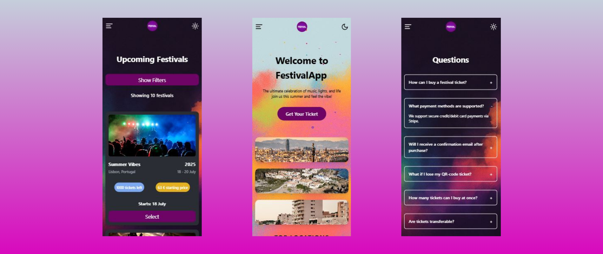

<body>
  <h1>🎶 Festival Ticket Web Application </h1>
  
  
'Festival' is a web application that focuses on the ticket sales of music festivals in a fully
    dynamic way. It displays festivals stored in a database to the user, who can browse through them, choose from
    various ticket types, and download their ticket in PDF format after completing the online payment.
  

  <h2>Features</h2>
  <ul>
    <li>Filtering and sorting options</li>
    <li>Three types of ticket categories (STANDARD, PREMIUM, VIP)</li>
    <li>Shopping cart </li>
    <li>Stripe card payment integration</li>
    <li>Responsive design </li>
    <li>Downloadable PDF ticket document</li>
  </ul>
  <h2>Tech Stack</h2>
  
Front-End: ReactJS, Tailwind CSS, JavaScript

  
Back-End: NodeJS, Express

  
Database: MongoDB

  <h2>Light/Dark Theme</h2>
  
  
The application also features light and dark themes, enhancing its aesthetics and providing a
    modern look across all pages.

  <h2>Information Form</h2>
  
  
A notification form is also available on the website, which allows users to receive future updates
    and news about the location they have selected.

  <h2>Questions</h2>
  
  
The webapp also includes a comprehensive FAQ (Frequently Asked Questions) section, where users can
    find clear and helpful answers to common questions related to ticket purchases, payment methods, downloading
    tickets, and other aspects of using the platform. This ensures a smoother user experience by addressing potential
    concerns in advance.

  <h2>Locations</h2>
  
  
The most popular and frequently searched cities are also featured on a dedicated page, allowing
    users to easily browse festivals by location. This helps visitors quickly find events in well-known destinations and
    enhances the overall navigation experience across the platform.
  

  <h2>Ticket Types</h2>
  
  
On the 'Prices' page, the three ticket types — Standard, Premium, and VIP — are clearly presented,
    highlighting the differences in pricing and what each option includes. This allows users to understand what benefits
    and features come with each category, helping them make an informed decision based on their preferences and budget.
  

  <h2>Browse</h2>
  
  
  
On the 'Browse' page, users can explore the available festivals with the help of various filters
    such as location, date, price, and music genre. Sorting options further enhance the search experience by allowing
    users to organize the results according to their preferences. On smaller devices, the filter section is hidden by
    default to maintain a clean and user-friendly layout, and it can be revealed with a single tap when needed.

  <h2>Festival Page</h2>
  <h3>Info</h3>
  
  <h3>Tickets</h3>
  
  <h3>Cart</h3>
  
  
When a user selects a festival, it opens on a dedicated page where all the detailed information
    about the event is displayed. This is also where ticket purchasing becomes available, along with access to the
    shopping cart functionality, allowing users to choose their preferred ticket type and proceed with the booking
    process seamlessly.

  <h2>Checkout</h2>
  
  
After adding one or more tickets to the cart, the user proceeds to the 'Checkout' page, where they
    are required to provide some personal information along with their credit card details for payment. Once all data is
    entered correctly, the transaction is processed, the ticket purchase is stored in the database, and the order is
    successfully completed.

  <h2>Summary</h2>
  
  <h3>PDF Document</h3>
  
  
After a successful payment, the user is redirected to the 'Summary' page, where their personal
    details and the purchased tickets are clearly displayed. The tickets can be downloaded in PDF format, which includes
    a QR code along with additional event-related information, providing a complete and convenient overview of the
    order.

  <h2>Responsive Design</h2>
  
  
To conclude, all pages and features have been built with full responsiveness in mind, ensuring
    accessibility across all smart devices. Most components are arranged in a vertical layout for optimal mobile
    viewing, and the navigation bar transforms into a collapsible menu accessible from the top-left corner.

